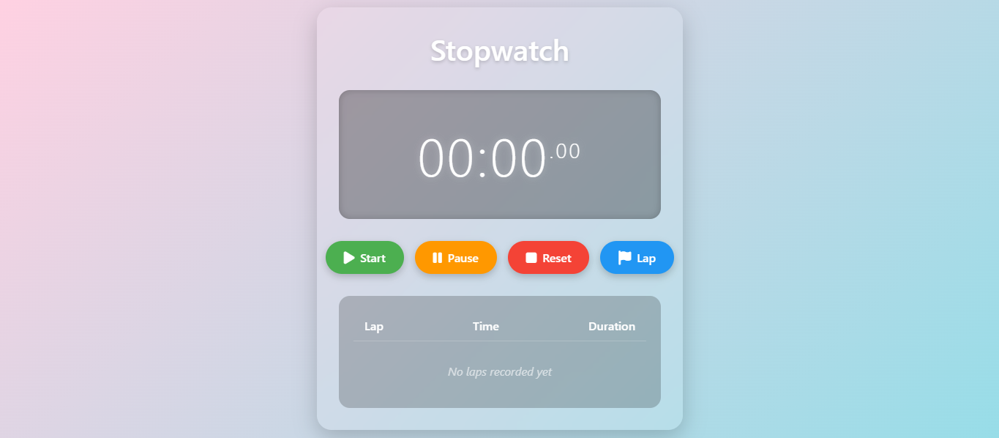

# ⏱️ Task 02 - Stopwatch Web Application  
### Internship @ Prodigy InfoTech  

A sleek and interactive **Digital Stopwatch Web Application** built using **HTML**, **CSS**, and **JavaScript**.  
This project was developed as part of my **Prodigy InfoTech Web Development Internship (Task 02)**.

## 🧠 About the Project  

This project is a **responsive, user-friendly stopwatch** that allows users to:  
- Start, pause, and reset time tracking  
- Record and display multiple **lap times**  
- See **duration per lap** and total time   
- Experience a clean and modern **glassmorphism UI**

---

## 💻 Features 

---
✅ Start, Pause, Reset, and Lap functionalities  
✅ Real-time time tracking up to milliseconds  
✅ Lap history with duration difference  
✅ Responsive design (works on mobile and desktop)  
✅ Hosted using GitHub Pages 

---

## 🛠️ Tech Stack

- **HTML5** – Structure of the stopwatch and layout  
- **CSS3** – Styling with responsive design and animations 
- **JavaScript (ES6)** – Stopwatch logic and interactivity,
---

## 🎯 Learning Outcomes

Through this task, I gained hands-on experience with:

- Build an interactive web application from scratch using core web technologies
- Implement timing functions and manage precise time intervals in JavaScript
- Use DOM manipulation to update UI elements dynamically
- Handle user events such as clicks and button states effectively
- Organize code structure by separating HTML, CSS, and JavaScript for maintainability
- Apply responsive design principles to ensure usability on all screen sizes

---

## 🚀 Live Demo
 
🔗 **View the project here:** [https://github.com/Khalipha-Samela/PRODIGY_WD_02.git]
---

## 📸 Preview

---

## 📬 Contact

💼 **Created by:** [Khalipha Samela]  
📧 **Email:** samelakhalipha@gmail.com  
🌐 **LinkedIn:** [www.linkedin.com/in/khalipha-samela]

---

### 🏁 Internship Details
**Organization:** Prodigy InfoTech  
**Task 02:** To build a stopwatch web application, you can use HTML, CSS, and JavaScript. HTML is used to structure the elements of the application. By implementing functions for starting, pausing, and resetting the stopwatch, as well as tracking and displaying lap times, users can accurately measure and record time intervals. With these technologies and functionalities, you can create an interactive and user-friendly stopwatch web application.

